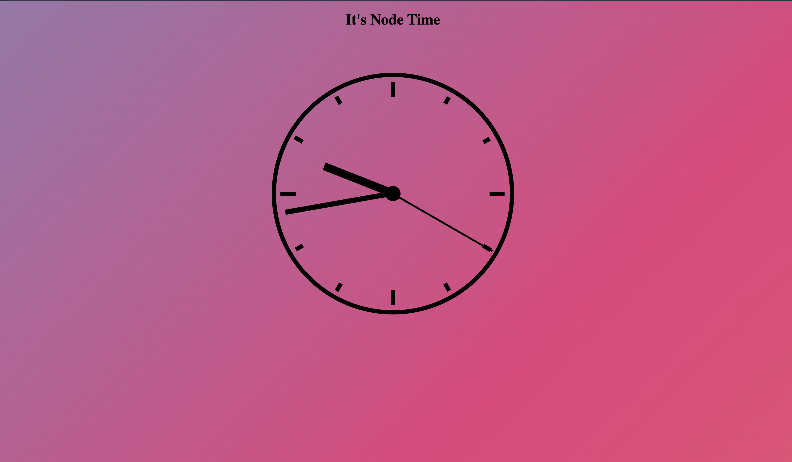

## Clock


This projects main purpose is to show you how to work with javaScripts built in methods

### Project Setup

```
1. clone repo
2. install live server extension
3. review acceptance criteria
4. start coding !
```

### Acceptance Criteria

1. No third party library's
2. Create a clock that is synced with the current time
   - should have hour, minutes and seconds
3. The clocks arms should move in accordance with the time

#### Helpful links

[JavaScript Date()](https://developer.mozilla.org/en-US/docs/Web/JavaScript/Reference/Global_Objects/Date)

[Transform](https://developer.mozilla.org/en-US/docs/Web/CSS/transform)

Special thanks to [Jarue Johnson](https://github.com/jaRue1) for putting this together
